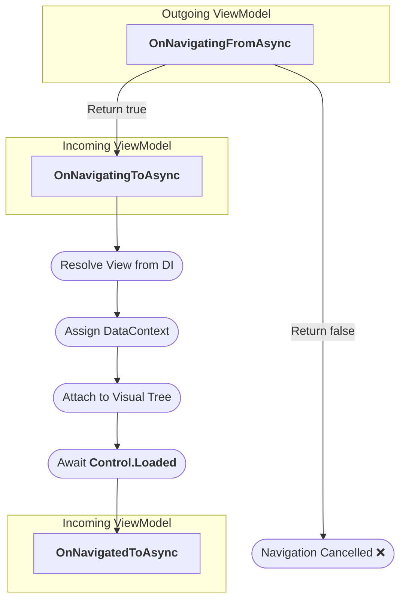

# Waypoint

[](https://www.nuget.org/packages/Ent3m.Waypoint)
[](https://www.nuget.org/packages/Ent3m.Waypoint)
[](https://avaloniaui.net/)
[](https://dotnet.microsoft.com/)
[](LICENSE.txt)

Waypoint is a View-first, type-safe navigation framework for Avalonia with native DI support.

## Features

- **Type Safety**: Navigate by View with compile-time enforcement. No regions, no magic strings.
- **DI-Native**: Views and ViewModels are resolved directly from the DI container.
- **Flexible Routing**: Navigate anywhere — swap views, open windows, or replace the main window.
- **Lifecycle Management**: Full control over transitions with data passing, guard, and hooks via [`INavigable`](#lifecycle-management).
- **Built-in Dialog**: Modal dialogs and popup toasts with source-generated implementations.
- **Native AOT**: Native AOT compilation and trimming support.
- **MVVM**: Navigation targets are passed as types, leaving ViewModels entirely decoupled from Views. Works with any MVVM framework.

## Quick Start

1. Register navigation in your DI Container:
```C#
public override void OnFrameworkInitializationCompleted()
{
    var services = new ServiceCollection();
    services.AddNavigation(ApplicationLifetime, RegisterViews);
    // configure views, view models, and other services
}

// Map views to view models
private static void RegisterViews(IViewRegistry views) => views
    .Register<HomeView, HomeViewModel>()
    .Register<SettingsView, SettingsViewModel>();
```
2. Inject `INavigator` and navigate:
```C#
public class HomeViewModel(INavigator navigator)
{
    public async Task GoToSettingsAsync()
    {
        await navigator.NavigateAsync<SettingsView>();
    }
}
```

## Install

[](https://www.nuget.org/packages/Ent3m.Waypoint/ "Download Waypoint from NuGet.org")
```
dotnet add package Ent3m.Waypoint
```
**Requirements**: .NET 8+
<br/>
**Dependencies**: Avalonia 12+, `Microsoft.Extensions.DependencyInjection.Abstractions` 8+

## Navigation Methods

| Methods | Descriptions | App Lifetime |
| :--- | :--- | :---: |
| [`NavigateAsync<TView>`](#container-navigations) | Swap the application's main view | SingleView |
| [`NavigateAsync<TView, TContainer>`](#container-navigations) | Swap the content of a containing `ContentControl` | Both |
| [`ShowPopupAsync<TView>`](#popup-toast) | Show a dismissible popup/toast | Both |
| [`ShowDialogAsync<TView, TResult>`](#modal-dialog) | Show an overlay dialog with typed result | Both |
| [`NavigateWindowAsync<TView>`](#window-navigations) | Swap the application's main window | Desktop |
| [`ShowWindowAsync<TView>`](#window-navigations) | Open a new window | Desktop |
| [`ShowWindowAsync<TView, TOwner>`](#window-navigations) | Open a new window with an owner | Desktop |
| [`ShowDialogWindowAsync<TView, TOwner>`](#window-navigations) | Open a dialog window with an owner | Desktop |
| [`ShowDialogWindowAsync<TView, TOwner, TResult>`](#window-navigations) | Open a dialog window with typed result and owner | Desktop |

## Lifecycle Management

Hook onto a ViewModel's navigation events by having it implement the `INavigable` interface.
```C#
public partial class SettingsViewModel : INavigable
{
    // Return false to cancel navigation
    async Task<bool> INavigable.OnNavigatingFromAsync(CancellationToken cancellationToken)
    {
        return await ConfirmLeaveAsync(cancellationToken);
    }
  
    // Called before the view is resolved
    async Task INavigable.OnNavigatingToAsync(object? parameter, CancellationToken cancellationToken)
    {
        if (parameter is AppState state)
            await InitializeStateAsync(state, cancellationToken);
    }
  
    // Called after the view is fully loaded and laid out
    async Task INavigable.OnNavigatedToAsync(object? parameter, CancellationToken cancellationToken)
    {
        StartAnimation();
    }
}
```
- `INavigable` callbacks run on the UI thread. Avoid doing synchronous blocking work here.
- `OnNavigatedToAsync` always fires after `Control.IsLoaded` is `true`. It is safe to perform UI-related works here.
- It is by design that the state parameter belongs to the destination and not passed onto `OnNavigatingFromAsync`. If two ViewModels genuinely need to share state to coordinate a transition, that state belongs in a shared service, not a navigation parameter.

### Sequence of Execution



## Container Navigations

Use `NavigateAsync<TView>` to replace `ISingleViewApplicationLifetime.MainView` with `TView`.
```C#
await navigator.NavigateAsync<HomeView>(cancellationToken: cancellationToken);
```
Use `NavigateAsync<TView, TContainer>` to replace the content of `TContainer` with `TView`.
```C#
await navigator.NavigateAsync<SettingsView, SideBarControl>("LeftSideBar", appState, cancellationToken);
```
- Prefer a specific `TContainer` derived from `UserControl`. Provide a `string` name when there are type collisions.
- The framework looks for a control matching the provided type and name in all active windows and in main view. When there are multiple matches, the first one in the logical tree is used.

## Window Navigations

Replace MainWindow entirely. Previous window is closed after the new one is shown.
```C#
await navigator.NavigateWindowAsync<MainWindow>();
```
Show a non-blocking window. Window with an owner will close when its owner closes.
```C#
await navigator.ShowWindowAsync<PreferencesWindow>();

// Window with an owner
await navigator.ShowWindowAsync<PreferencesWindow, MainWindow>();
```
- When there are multiple active windows of type `TOwner`, the first one in `IClassicDesktopStyleApplicationLifetime.Windows` is used.
<br/>

Show a blocking dialog window. Task completes when the window closes.
```C#
await navigator.ShowDialogWindowAsync<AboutWindow>();

// Dialog window with an owner
await navigator.ShowDialogWindowAsync<AboutWindow, MainWindow>();

// Dialog window with typed result and an owner
var result = await navigator.ShowDialogWindowAsync<SaveWindow, MainWindow, SaveResult>();
```

## Overlay Dialogs

### Popup Toast
Show a light-dismiss popup with `ShowPopupAsync<TView>`. Popup is dismissed when the user clicks anywhere or presses Escape.
```C#
// Optionally, make it auto-dismiss using CancellationTokenSource
using var cts = new CancellationTokenSource(3000);
await navigator.ShowPopupAsync<InfoPopup>(verticalPlacement: VerticalAlignment.Top, cancellationToken: cts.Token);
```

### Modal Dialog
Show a blocking modal dialog with typed result with `ShowDialogAsync<TView, TResult>`.
```C#
bool confirmed = await navigator.ShowDialogAsync<ConfirmDialog, bool>(parameter: "Delete this item?");
```
- `TView` must implement `IDialogView<TResult>`. The dialog result is returned when the View fires `IDialogView<TResult>.CloseRequested`.
<br/>

**Recommended**: Use source generator to implement `IDialogView` automatically by annotating a ViewModel's event of type `Action<TResult>` with the `[DialogResult(typeof(TView))]` attribute.
```C#
public partial class ConfirmDialogViewModel
{
    [DialogResult(typeof(ConfirmDialog))]
    public event Action<bool>? CloseRequested;

    public void Confirm() => CloseRequested?.Invoke(true);
    public void Cancel()  => CloseRequested?.Invoke(false);
}
```
- The generated code safely wires the ViewModel's event to the View's `IDialogView<TResult>.CloseRequested` event via `OnAttachedToLogicalTree` / `OnDetachedFromLogicalTree` to prevent memory leaks.
<br/>

**Theming**: The dialog overlay renders a semi-transparent layer behind the dialog content. Override the default color (`#99000000`) by defining the `WaypointDialogDimBrush` resource in your application:
```xml
<Application.Resources>
    <SolidColorBrush x:Key="WaypointDialogDimBrush" Color="#CC000000" />
</Application.Resources>
```

## Source Generator Diagnostics

The `[DialogResult]` source generator ships with a Roslyn analyzer that reports errors at build time:

| Code | Description |
|---|---|
| `WYPT01` | The View type does not inherit from `Avalonia.StyledElement` |
| `WYPT02` | Generic View or ViewModel types are not supported |
| `WYPT03` | The event must be `internal` or `public` for the generated View to access it |
| `WYPT04` | The event delegate must return `void` and accept exactly one parameter |

## Samples

- [WabbaRush](https://github.com/ent3m/WabbaRush): a desktop application using Waypoint for navigation.